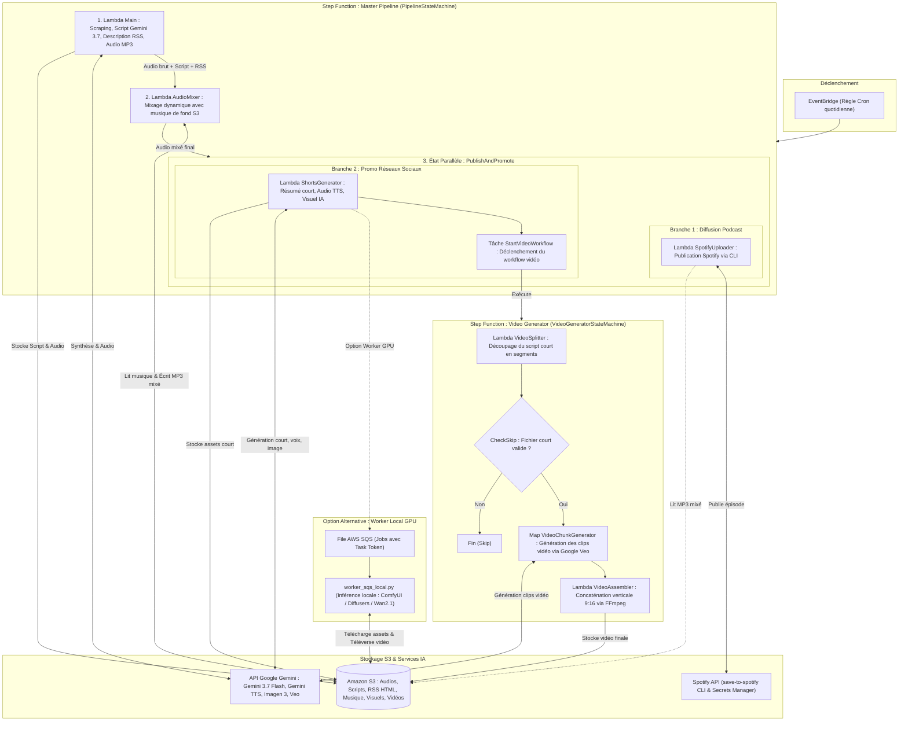

# Pipeline Automatisé de Podcast Thématique (Docker Lambda & IA)

Ce projet est une déclinaison isolée et entièrement variabilisée du pipeline de génération de podcast. Il permet de produire, synthétiser et publier un podcast quotidien dédié à une **thématique spécifique** (par exemple : *Tech & IA*, *Cinéma*, *Science*, *Business/Finance*, *Histoire*, etc.) ainsi que ses déclinaisons courtes (Shorts, visuels IA, vidéos).

Grâce à la variabilisation complète via `PROJECT_PREFIX` et `.utils/config.env`, ce projet peut être déployé sur le **même compte AWS** que le projet d'actualités généraliste sans aucun conflit de noms (S3, ECR, Lambdas, Step Functions, IAM, Secrets Manager).

---

## 🚀 Architecture & Fonctionnement



### Modules inclus :
1. **`Main/`** :
   - Scrape les sources spécialisées configurées dans [`Main/config.json`](file:///home/hig/develop/docker-lambda-thematic/Main/config.json) avec protection anti-bot et fallback automatique sur les résumés de flux RSS.
   - Utilise **Gemini 3.7 Flash** pour générer :
     - Le script audio complet incarné par l'animateur thématique configuré.
     - Une description structurée d'épisode pour le flux RSS au format CDATA HTML léger avec liens cliquables vers les sources.
   - Génère l'audio complet via **Gemini 3.1 Flash TTS Preview** (voix configurable ex: *Laomedeia*, *Aoede*, etc.).
   - Convertit en MP3 via FFmpeg et téléverse le script, les sources et l'audio sur le bucket S3 dédié.
   - Contient l'outil de diagnostic local [`Main/test_scraper.py`](file:///home/hig/develop/docker-lambda-thematic/Main/test_scraper.py).
2. **`AudioMixer/`** :
   - Mixe dynamiquement une musique de fond aléatoire stockée dans `ressources/music/` sur le bucket S3 avec la piste vocale générée.
   - Gère le fondu entrant (*fade-in*) et le fondu sortant (*fade-out*) à la fin de l'épisode via FFmpeg (`amix`, `afade`).
   - Écrase le MP3 principal dans S3 avec la version mixée (avec contournement gracieux si aucune musique n'est encore téléversée).
3. **`ShortsGenerator/`** :
   - Résume le script quotidien en format court (~45s) percutant pour les réseaux sociaux.
   - Génère la piste audio MP3 courte via Gemini TTS + FFmpeg.
   - Génère une illustration carrée photoréaliste personnalisée via Imagen 3 / Gemini Image.
   - Transmet les clés S3 complètes (`s3_audio_key`, `s3_script_key`, `s3_image_key`).
4. **`SpotifyUploader/`** :
   - Téléverse automatiquement l'épisode sur l'émission Spotify dédiée via le CLI `save-to-spotify` et les identifiants stockés dans Secrets Manager.
5. **`VideoGenerator/`** & **`worker_sqs_local.py`** :
   - **Cloud** : Découpe le script court, génère les segments vidéo séquentiels avec cohérence visuelle, et assemble la vidéo finale au format vertical 9:16.
   - **Local GPU** : `worker_sqs_local.py` écoute une file SQS alimentée par Step Functions Task Token pour exécuter des modèles vidéo lourds en local (ComfyUI / Diffusers / Wan2.1 / FFmpeg).
6. **`heygenGenerator/`** & **`tiktokgenerator/`** :
   - Modules d'extension pour la génération d'avatar vidéo et la distribution automatique sur TikTok / YouTube Shorts via Buffer.

---

## ⚙️ Configuration & Variabilisation

Toutes les ressources sont centralisées dans [`.utils/config.env`](file:///home/hig/develop/docker-lambda-thematic/.utils/config.env).

### Isolation garantie sur le même compte AWS :
| Ressource AWS | Projet Original (`docker-lambda`) | Ce Projet Thématique (`docker-lambda-thematic`) |
| :--- | :--- | :--- |
| **Préfixe** | `autopodcast` / statique | `thematic-podcast` (ou votre préfixe personnalisé) |
| **Bucket S3** | `votre-ancien-bucket` | `thematic-podcast-audio-storage-eu-west-1` |
| **ECR Repos** | `my-lambda-function-main` | `thematic-podcast-main` |
| **Lambda Main** | `Main` ou `autopodcast` | `thematic-podcast-Main` |
| **Lambda Mixer**| `AudioMixer` | `thematic-podcast-AudioMixer` |
| **Lambda Shorts** | `ShortsGenerator` | `thematic-podcast-ShortsGenerator` |
| **Lambda Spotify**| `SpotifyUploader` | `thematic-podcast-SpotifyUploader` |
| **Step Function** | `VideoGeneratorStateMachine` | `thematic-podcast-VideoGeneratorStateMachine` |
| **Master SFN** | `arn:...:stateMachine:...` | `thematic-podcast-PipelineStateMachine` |
| **Secret Spotify**| `SpotifyCredentials` | `thematic-podcast-SpotifyCredentials` |
| **Rôle IAM** | `PodcastLambdaExecutionRole` | `thematic-podcast-lambda-execution-role` |


---

## 🎨 Comment Personnaliser le Thème du Podcast

### Option 1 : Via `.utils/config.env`
Ouvrez [`.utils/config.env`](file:///home/hig/develop/docker-lambda-thematic/.utils/config.env) et ajustez :
```bash
PODCAST_TITLE="Tech & IA Horizon"
PODCAST_HOST="Alex, votre guide tech"
PODCAST_THEME="L'Intelligence Artificielle, la robotique et le futur de la Tech"
PODCAST_DURATION="8 à 12 minutes"
GEMINI_TTS_VOICE="Laomedeia" # Options: Laomedeia, Aoede, Charon, Fenrir, Puck, Zephyr
SPOTIFY_SHOW_ID="spotify:show:VOTRE_SHOW_ID"
```

### Option 2 : Via `Main/config.json`
Éditez [`Main/config.json`](file:///home/hig/develop/docker-lambda-thematic/Main/config.json) pour ajouter ou modifier les flux RSS et sites web de veille thématique.

Pour tester le bon fonctionnement de votre scraping sans appel payant à Gemini :
```bash
./.utils/test-scraping.bash
```

---

## 🚀 Déploiement

### 1. Prérequis
- Docker en cours d'exécution.
- AWS CLI configuré (`aws configure`).
- Clé API Gemini placée dans `.secret/geminikey` ou exportée sous `GEMINI_API_KEY`.

### 2. Déploiement en 1 seule commande
Pour déployer l'infrastructure, toutes les images ECR, les fonctions Lambda (Main, AudioMixer, Shorts, Spotify) et les Step Functions :
```bash
./.utils/deploy-all.bash
```

### 3. Déploiement composant par composant (si nécessaire)
- **Infrastructure de base (S3 + IAM)** :
  ```bash
  ./.utils/setup-aws-infra.bash
  ```
- **Lambda principale (Scraping + Gemini Script & Audio)** :
  ```bash
  ./.utils/build-and-upload.bash Main
  ```
- **Lambda AudioMixer (Musique de fond)** :
  ```bash
  ./.utils/deploy-audiomixer.bash
  ```
- **Lambda Shorts (Résumé court + Audio + Illustration)** :
  ```bash
  ./.utils/build-and-upload.bash ShortsGenerator
  ```
- **Lambda Spotify (Téléversement)** :
  ```bash
  ./.utils/build-and-upload.bash SpotifyUploader
  ```
- **Module Vidéo & Step Functions** :
  ```bash
  ./.utils/deploy-videogenerator.bash
  ./.utils/deploy-pipeline.bash
  ```

---

## 🧪 Test Local & Worker GPU

### Test d'une Lambda en conteneur Docker :
```bash
./.utils/run-local.bash Main
```
Puis dans un autre terminal :
```bash
curl -XPOST "http://localhost:9000/2015-03-31/functions/function/invocations" -d '{}'
```

### Diagnostic de Scraping :
```bash
./.utils/test-scraping.bash
```

### Worker SQS Local (GPU) :
```bash
export SQS_QUEUE_URL="https://sqs.eu-west-1.amazonaws.com/VOTRE_ACCOUNT_ID/votre-file-sqs"
python3 worker_sqs_local.py
```
