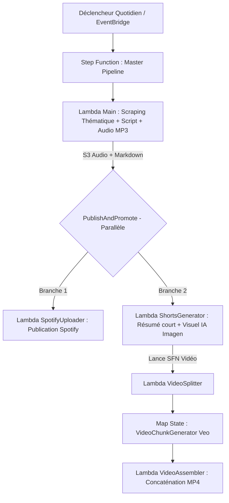

# Pipeline Automatisé de Podcast Thématique (Docker Lambda & IA)

Ce projet est une déclinaison isolée et entièrement variabilisée du pipeline de génération de podcast. Il permet de produire, synthétiser et publier un podcast quotidien dédié à une **thématique spécifique** (par exemple : *Tech & IA*, *Cinéma*, *Science*, *Business/Finance*, *Histoire*, etc.) ainsi que ses déclinaisons courtes (Shorts, visuels IA, vidéos).

Grâce à la variabilisation complète via `PROJECT_PREFIX` et `.utils/config.env`, ce projet peut être déployé sur le **même compte AWS** que le projet d'actualités généraliste sans aucun conflit de noms (S3, ECR, Lambdas, Step Functions, IAM, Secrets Manager).

---

## 🚀 Architecture & Fonctionnement



### Modules inclus :
1. **`Main/`** :
   - Scrape les sources spécialisées configurées dans [`Main/config.json`](file:///home/hig/develop/docker-lambda-thematic/Main/config.json).
   - Utilise **Gemini 3.7 Flash** pour synthétiser un script captivant incarné par l'animateur thématique configuré.
   - Génère l'audio complet via **Gemini 3.1 Flash TTS Preview** (voix configurable ex: *Laomedeia*, *Aoede*, etc.).
   - Convertit en MP3 via FFmpeg et téléverse sur le bucket S3 dédié.
2. **`ShortsGenerator/`** :
   - Résume le script quotidien en format court (~1 min) pour les réseaux sociaux.
   - Génère une illustration carrée photoréaliste personnalisée via le modèle image de Gemini / Imagen.
3. **`SpotifyUploader/`** :
   - Téléverse automatiquement l'épisode sur l'émission Spotify dédiée via le CLI `save-to-spotify` et les identifiants stockés dans Secrets Manager.
4. **`VideoGenerator/`** :
   - Découpe le script court, génère les segments vidéo séquentiels avec cohérence visuelle, et assemble la vidéo finale au format vertical 9:16.
5. **`heygenGenerator/`** & **`tiktokgenerator/`** :
   - Modules d'extension pour la génération d'avatar vidéo et la distribution automatique sur TikTok / YouTube Shorts via Buffer.


---

## 🎨 Comment Personnaliser le Thème du Podcast

### Option 1 : Via `.utils/config.env`
Ouvrez [`.utils/config.env`](file:///home/hig/develop/docker-lambda-thematic/.utils/config.env) et ajustez :
```bash
PODCAST_TITLE="Tech & IA Horizon"
PODCAST_HOST="Alex, votre guide tech"
PODCAST_THEME="L'Intelligence Artificielle, la robotique et le futur de la Tech"
PODCAST_DURATION="8 à 12 minutes"
GEMINI_TTS_VOICE="Laomedeia" # Options: Laomedeia, Aoede, Charon, Fenrir, Puck, Zephyr
SPOTIFY_SHOW_ID="spotify:show:VOTRE_SHOW_ID"
```

### Option 2 : Via `Main/config.json`
Éditez [`Main/config.json`](file:///home/hig/develop/docker-lambda-thematic/Main/config.json) pour ajouter ou modifier les flux RSS et sites web de veille thématique.

---

## 🚀 Déploiement

### 1. Prérequis
- Docker en cours d'exécution.
- AWS CLI configuré (`aws configure`).
- Clé API Gemini placée dans `.secret/geminikey` ou exportée sous `GEMINI_API_KEY`.

### 2. Déploiement en 1 seule commande
Pour déployer l'infrastructure, toutes les images ECR, les fonctions Lambda et les Step Functions :
```bash
./.utils/deploy-all.bash
```

### 3. Déploiement composant par composant (si nécessaire)
- **Infrastructure de base (S3 + IAM)** :
  ```bash
  ./.utils/setup-aws-infra.bash
  ```
- **Lambda principale** :
  ```bash
  ./.utils/build-and-upload.bash Main
  ```
- **Lambda Shorts** :
  ```bash
  ./.utils/build-and-upload.bash ShortsGenerator
  ```
- **Lambda Spotify** :
  ```bash
  ./.utils/build-and-upload.bash SpotifyUploader
  ```
- **Module Vidéo & Step Functions** :
  ```bash
  ./.utils/deploy-videogenerator.bash
  ./.utils/deploy-pipeline.bash
  ```

---

## 🧪 Test Local
Pour tester une Lambda localement dans son conteneur Docker :
```bash
./.utils/run-local.bash Main
```
Puis dans un autre terminal :
```bash
curl -XPOST "http://localhost:9000/2015-03-31/functions/function/invocations" -d '{}'
```
