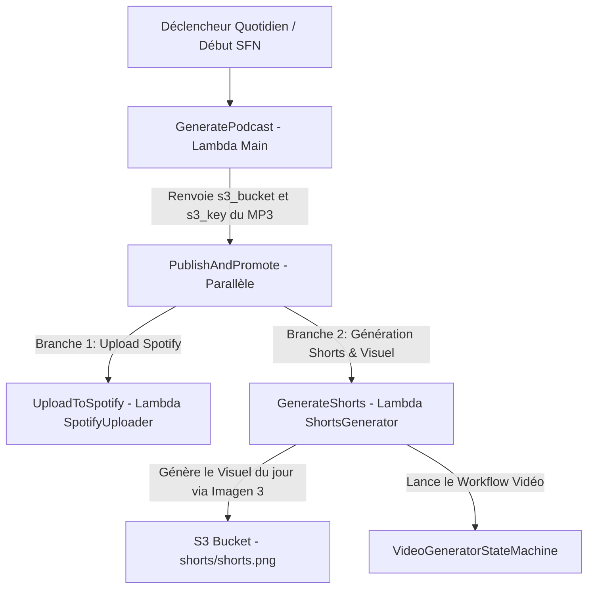

# Rapport d'Implémentation : Publication Spotify & Pipeline Automatisé (Projet Thématique)

Ce document détaille l'intégration du téléversement automatique des épisodes vers Spotify pour ce projet thématique à l'aide de l'outil `save-to-spotify` et de la Step Function AWS orchestrée.

---

## 🏗️ Architecture du Pipeline



---

## 🔑 Configuration Spotify pour ce Projet Dédié

Pour publier vos épisodes sur une émission (Show) spécifique sans interférer avec votre autre podcast :

### 1. Obtenir vos jetons Spotify (si nouveau compte ou mêmes identifiants)
```bash
# Installation du CLI local
curl -fsSL https://saveto.spotify.com/install.sh | bash

# Connexion initiale
save-to-spotify auth login

# Encodage en Base64
base64 -w 0 < ~/.config/save-to-spotify/token.json > token_b64.txt
base64 -w 0 < ~/.config/save-to-spotify/dpop_key.json > dpop_b64.txt
```

### 2. Enregistrement dans AWS Secrets Manager
Créez un secret dédié dans AWS Secrets Manager nommé par exemple **`thematic-podcast-SpotifyCredentials`** (défini par `SPOTIFY_SECRET_NAME` dans [`.utils/config.env`](file:///home/hig/develop/docker-lambda-thematic/.utils/config.env)) contenant le JSON suivant :
```json
{
  "token_b64": "LE_CONTENU_DE_TOKEN_B64.TXT",
  "dpop_key_b64": "LE_CONTENU_DE_DPOP_B64.TXT"
}
```

### 3. Configurer le Show ID
Dans [`.utils/config.env`](file:///home/hig/develop/docker-lambda-thematic/.utils/config.env), renseignez l'identifiant de votre émission :
```bash
SPOTIFY_SHOW_ID="spotify:show:VOTRE_SHOW_ID_ICI"
```

---

## 🚀 Déploiement

Pour déployer la Lambda `SpotifyUploader` :
```bash
./.utils/build-and-upload.bash SpotifyUploader
```
